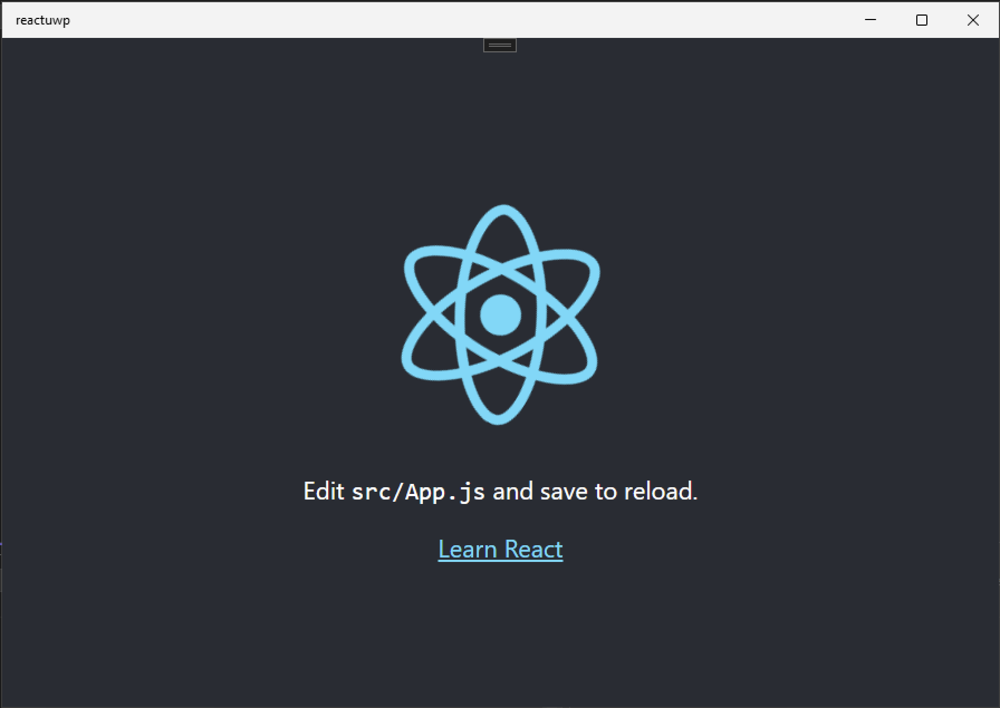
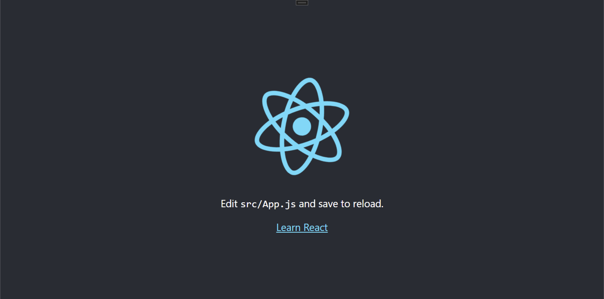
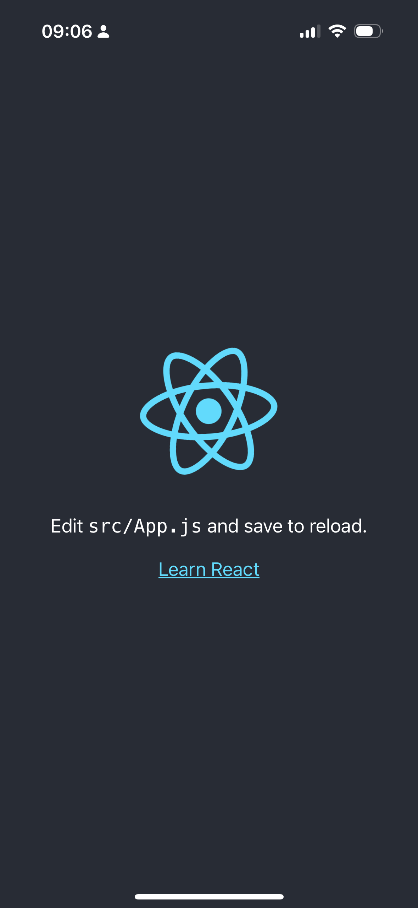

# Capacitor Xbox

<p align="center">
  
</p>

Capacitor Xbox brings Capacitor apps to UWP/WebView2 for Windows and Xbox. It ships a ready UWP.js host, a native C# WinRT bridge, and a Capacitor 8 runtime shim so a web app can call native-backed Capacitor-style APIs on Microsoft platforms.

| Windows | Xbox | iOS |
|---------|------|-----|
|  |  |  |
| [capacitor-xbox](https://www.npmjs.com/package/capacitor-xbox) | [capacitor-xbox](https://www.npmjs.com/package/capacitor-xbox) | [Capacitor](https://capacitorjs.com) |

It is not affiliated with Capacitor, Ionic, Microsoft, or Xbox.

## What You Get

- UWP/WebView2 host generation for Windows and Xbox
- Capacitor 8-compatible runtime globals inside the UWP host
- Broad native-backed plugin surface for common Capacitor app APIs
- Neutral `uwp.js` bridge for direct UWP.js usage
- Xbox-focused host behavior: back button forwarding, controller vibration, in-app toasts, cursor control, and centered browser overlays
- CLI workflow with `capacitor-xbox init` and `capacitor-xbox sync`

## Capacitor 8 Runtime

- `@capacitor/core` peer dependency: `>=8.0.0 <9.0.0`
- typed exports for `capacitor-xbox`, `capacitor-xbox/uwp`, and `capacitor-xbox/capacitorUWP`
- UWP/Xbox plugin headers for official-style Capacitor plugin proxies
- `CapacitorCustomPlatform` plugin map inside the WebView2 host
- native bridge globals: `PluginHeaders`, `nativePromise`, and `nativeCallback`
- safe browser imports outside UWP, so normal web/iOS/Android builds keep their default Capacitor behavior

## Install

```bash
npm install capacitor-xbox
```

Create or sync the UWP project:

```bash
npx capacitor-xbox init
npm run build
npx capacitor-xbox sync
```

Useful sync options:

```bash
npx capacitor-xbox sync --patch-wasm
npx capacitor-xbox sync --patch-css
```

## App Entry Setup

Make `capacitor-xbox/capacitorUWP` the first Capacitor runtime import in your app entry. Plugin packages loaded after it register against the UWP/Xbox runtime.

```js
import "capacitor-xbox/capacitorUWP";
import { Preferences } from "@capacitor/preferences";

await window.CapacitorUWP?.ready;

await Preferences.set({ key: "theme", value: "dark" });
const result = await Preferences.get({ key: "theme" });
console.log(result.value);
```

For raw UWP.js usage without Capacitor:

```js
import UwpBridge from "capacitor-xbox/uwp";

const uwp = new UwpBridge();
await uwp.hideCursor();
await uwp.showCursor();
```

## Runtime Behavior

Inside the generated UWP WebView2 host, `capacitor-xbox/capacitorUWP` auto-installs:

- `window.Capacitor`
- `window.capacitor`
- `window.CapacitorUWP`
- `CapacitorCustomPlatform`
- `PluginHeaders`
- `nativePromise`
- `nativeCallback`

The bridge exposes `window.CapacitorUWP.ready` for apps that want an explicit host-ready hook during startup. Outside the UWP host, the package stays passive and lets the normal Capacitor web runtime run unchanged.

## Supported API Surface

Broadly supported or shimmed:

- `ActionSheet`
- `App`
- `AppLauncher`
- `Browser`
- `Clipboard`
- `Device`
- `Dialog`
- `LocalNotifications`
- `Motion`
- `Network`
- `Preferences`
- `PushNotifications`
- `ScreenOrientation`
- `ScreenReader`
- `Share`
- `SplashScreen`
- `TextZoom`
- `Toast`
- `Camera`
- `Filesystem`
- `FileTransfer`
- `FileViewer`
- `Geolocation`
- `Haptics`
- `Keyboard`
- `CapacitorBarcodeScanner`
- `SecureStorage`
- `UserVerification`
- `CapacitorBackgroundRunner` / `BackgroundRunner`
- `CapacitorGoogleMaps` / `GoogleMaps`

The underlying host uses real UWP/WinRT APIs where practical: WebView2, app notifications/toasts, `PasswordVault`, `UserConsentVerifier`, storage folders/pickers, `CameraCaptureUI`, `Geolocator`, `NetworkInformation`, clipboard, share UI, display/input events, sensors, speech synthesis, WNS push, and POS barcode scanner hardware.

## Platform Notes

Some mobile APIs map to UWP equivalents, some are shimmed, and a small set are platform-specific:

- `StatusBar`: unsupported because desktop UWP/Xbox does not expose Android/iOS-style status bar controls.
- `SystemBars`: not implemented yet. UWP/Xbox has no direct Android/iOS system-bar equivalent.
- `Watch`: unsupported because it targets watchOS.
- `GoogleMaps`: implemented with Leaflet/OpenStreetMap, not the native Google Maps SDK.
- `CapacitorBarcodeScanner`: supports UWP POS scanner hardware; camera barcode scanning is not implemented yet.
- `Camera.editPhoto` / `Camera.editURIPhoto`: unsupported because UWP has no built-in Capacitor-compatible editor.
- iOS limited photo-library APIs return limited or empty results because UWP has no equivalent permission model.
- `Keyboard.setAccessoryBarVisible` and `Keyboard.setScroll`: unsupported because they are iOS-specific controls.
- `BackgroundRunner`: useful UWP script-runner shim, but still subject to Windows/Xbox background execution policy.
- Push notifications use WNS, not APNs or FCM.
- Permission APIs are approximations where UWP/Xbox does not match Android/iOS runtime permissions.

Next API targets:

- `CapacitorCookies`
- `CapacitorHttp`
- `InAppBrowser`
- `PrivacyScreen`
- `LocalLLM`
- core `WebView` plugin methods

Regular browser `fetch`, cookies, and WebView2 behavior still work as normal web APIs. They are just not exposed as full Capacitor plugin-compatible native shims yet.

## UWP Host Features

The generated UWP host includes:

- WebView2 local asset hosting
- local app data virtual host mapping
- RPC timeout handling
- native-to-JS event forwarding
- centered embedded browser overlay
- Xbox-friendly in-app toast overlay
- Windows app notifications
- back button forwarding
- controller vibration
- persistent cursor hide/show API
- optional background script dispatch

The cursor is hidden by default in the host and reapplied on pointer/window events. Use `uwp.hideCursor()` and `uwp.showCursor()` from the neutral UWP.js bridge when you need to control it.

## Project Structure

After `init`, a project typically looks like:

```text
my-capacitor-xbox-project/
├─ package.json
├─ capacitor.config.ts
├─ resources/
├─ uwp_js.config.json
├─ uwp/
│  └─ <ProjectName>/
│     ├─ MainPage.xaml
│     ├─ MainPage.xaml.cs
│     ├─ <ProjectName>.csproj
│     ├─ Package.appxmanifest
│     ├─ Assets/
│     │  └─ WP/
│     └─ ...
└─ ...
```

`Assets/WP` is where your built web app is copied during `capacitor-xbox sync`.

## Notes

- Build the web app first, then run `capacitor-xbox sync`.
- On Xbox, file pickers, camera UI, background execution, and hardware APIs depend on device policy and installed capabilities.
- WebAssembly or zip assets may need `--patch-wasm` or other packaging workarounds for WebView2/Edge loading behavior.
- Native UWP compilation still needs Visual Studio/Windows tooling.

## Extending The Native Host

The C# backend lives in the generated UWP project. Add native methods to `UwpNativeMethods` as public `Task<string>` methods, then call them from the JavaScript bridge with `bridge.callNative(...)` or a typed wrapper in `uwp.js`.

Keep the native host neutral. Capacitor-specific behavior should stay in `capacitorUWP.js`; the UWP host should expose generic UWP.js capabilities.

## Links

- npm: https://www.npmjs.com/package/capacitor-xbox
- UWP.js: https://github.com/momo-AUX1/UWP.js
- Capacitor: https://capacitorjs.com/
